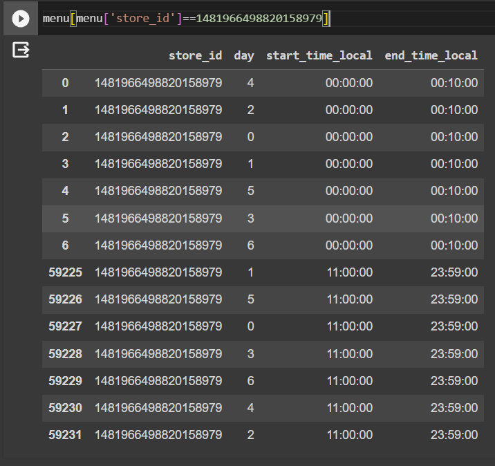

# Store Monitoring
This assignment will help identify restaurant owners identify how frequently their stores go offline

## Data Cleaning
I did some EDA on all three datasets and found values that were absent in some of the datasets.
There were few stores that were present in business hour and timezone data that were missing from store data. Such data was removed. There were few stores that were present in stores but absent in business hour and timezone data. Such data was added according to the conditions specified in the task. (Timezone - America/Chicago , Business Hour - 00:00:00 - 23:59:59)
In the business hour dataset , there were some stores that contained data that were not accurate. For example, store with `id = 1481966498820158979` contained multiple business hours for each day of the week that were innacurate. It showed that the store was open from 00:00:00 to 00:10:00 and from 11:00:00 to 23:59:00 on Monday. Such duplicate and innacurate entries were removed.

After cleaning the datasets they were stored to the postgreql database.


## Computing uptime and downtime 

## Running the store monitor
Follow the following instructions to run the data generator
### clone the repository
    git clone https://github.com/johntharian/dreamrunner-labs-codingtest.git
### open the repository
    cd dreamrunner-labs-codingtest
#### create a virtual environment using conda
    conda create --name dreamrunner_env
### activate the virtual environment
    conda activate dreamrunner_env
### install pip 
    conda install pip
### install the required packages from requirements.txt
    pip install -r requirements.txt
## To run the data generator
    python main.py --amount 5 --shape cube --action create
### Modifying arguments
    The program will work even if amount, shape and action are not specified
    The default value for amount is 5, shape and action are chosen at random


# Goal
The goal of this assignment is to test your logic and the way you structure the code. We will be reviewing your nomenclature, how you build systems, as well as code organization and how well you comment your code. We will also take a look at the various commits will be doing along the way.

# Context
Surreal is a tool that leverages the power of the GPT model to transform natural language commands into actions performed by the Unreal Engine editor.
You will be attempting at writing a function that generates meaningful sentences that can be used to train the model.
We'll have two actions: `create` and `delete`. An example sentence for `create` could be "Create 2 squares.". An example sentence for the `delete` action could be "Delete the actor named SphereR.".

# Tasks
- Create a dictionnary called `fragments`. The goal of this dictionnary is to list various "piece of sentence" and their synonyms. For example "cube" has synonyms such as "cubes", "cube shape", etc... And "create" has synonyms such as "spawn", "add", "generate", etc...
- Create a function called `generate_sentence` that will use the `fragments` dictionnary to build sentences, randomly selecting synonyms along the way.
- Create a function called `generate_training_data` that receives `amount` as a parameter which defines the amount of samples it will generate. That function will use `generate_sentence` to generate sentences and store them in a JSON object under the following format:
### For `create`
```json
{"message": "Spawn a cube.", "intent": "create", "entities": {"shape": "cube", "amount": "1"}}
```

### For `delete`
```json
{"message": "Delete actor named Cube1.", "intent": "delete", "entities": {"name": "Cube1"}}
```

- Make sure `generate_training_data` writes to file its response in a JSON file named `training-data` located in the `training` folder.
- Make sure you generate the given amount of sentences for each shape. The available shapes are `Cube`, `Sphere`, `Cone`, and `Plane`.
- Make sure you understand no specific format for your `fragments` object has been provided. You are also free to add parameters to functions as you wish to. And the goal essentially is to have a system that will generate the given amount of samples for each shapes, and for each actions. You are free to build any system you wish to accomplish the task.

Good luck for the assignment and keep in mind that if you have any questions, you are free to ask us anything but please do it as soon as you have the question!

Please create a repository with the code for this assignment and send us an invite to join this repository as collaborators so we can check your solution.
GitHub users to add as collaborators:
- Joks84
- rmnsnc
